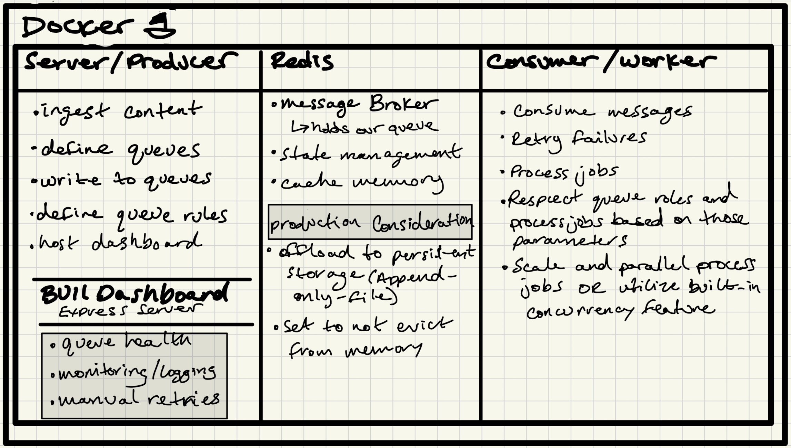
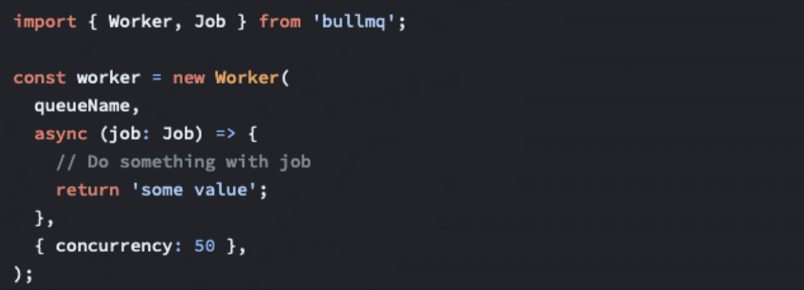

# Architecture

## Why Dockerize?
- Can manually scale consumers based on workload and available system resources
- Seperation of concerns
- Portability and deployability across many OSes - barebones or not
- Very particular resource allotment

## Server Specs
- Depends on workload
- Test with 2 CPU cores, 4gb of memory, and 64gb of hard drive space
- App idles at only 100mb of memory assuming an empty Redis cache and a single server + worker

## Persistence
Check out [this guide](https://docs.bullmq.io/guide/going-to-production). We enable the follow two Redis settings:
1. [Append-only-file + RDB](https://redis.io/docs/management/persistence/)
2. `maxmemory` set to `noeviction`

### Current Setup
Currently, the app has the following settings:

#### Redis Database
The snapshot will be replicated in the host machine's `redis` folder

* After 3600 seconds (an hour) if at least 1 change was performed
* After 300 seconds (5 minutes) if at least 100 changes were performed
* After 60 seconds if at least 10000 changes were performed

Note that this is the default configuration and we did not have to make any changes to `redis.conf`.

#### Append-only-file
The AOF will be replicated in the host machine's `redis/appendonlydir` folder

* `appendonly yes`

Note that we did have to make this change to `redis.conf`.

# How To Use This App

## Running The App
Assuming you have Docker Desktop installed, it will have installed Docker Compose for you. Simply pull the repo and run `docker compose up`. Append `-d` to run detached from the terminal. If you're making changes to the app, all you need to do is re-run the same command with the `--build` flag.

## Server and Dashboard

## Worker

## Redis
Nothing to do here unless you're deploying to prod - then please see [this post here](https://docs.bullmq.io/guide/going-to-production).

I changed the following security settings in `redis.conf`

`bind 127.0.0.1 -::1` -> `# bind 127.0.0.1 -::1`
`protected-mode yes` -> `protected-mode no`

### Examples On How To Run The App
`docker compose up`
`docker compose up -d`
`docker compose up --build`
`docker compose up --build --scale worker=2`
`docker compose up -d --build --scale worker=2`

## Delayed Jobs

## Retrying Jobs

## Repeating Jobs

## Prioritizing Jobs

## Concurrency a.k.a. "I Want To Go Faster"

### Producer
A bit more complicated than increasing the number of workers. For the purposes of ingesting a CSV to process data (which is what this app was made for) you will want to split your workload into even parts and spin up more producers to handle each of those parts - configuring each instace with the correct piece of data. There will probably be a programmatic way to feed a CSV across multiple docker containers - create a PR if you work on it! Granted, we'll need to solve the problem of how to use just one Bull Dashboard...

If you were to utilize BullMQ for a REST based application, you would spin up multiple producers and then a load balancer like NGINX to direct traffic to the next available producer, but that's not in the application's scope.

### Worker
Much easier here - we can scale the app in two ways (and combine the two for ULTIMATE speed):
1. The built in concurrency variable will allow us to take full advantage of a single worker's capacity - see code snippet below
2. Manully create more docker containers for the worker. How? Easy... Get comfy with docker compose and try a `docker compose up --scale worker=5`

# Security
By default, the app stores data in clear text - namely in Redis. Avoid storing sensitive date in the jobs and intead retrieve the data securely at the time a job is being processed. If you must store confidential data, please encrypt the sensitive parts.
